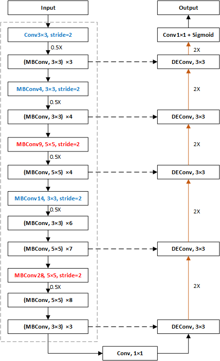
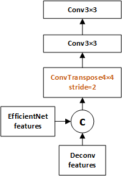

# 这是一个将EfficientNet-b5的分类模型改成分割任务的代码示例

   总体采用U型结构，特征提取下采样结构使用EfficientNet-b5，上采样是由一系列DEConv模块组成的串联结构。

### UEfficientNet网络模型整体结构如下：

### DEConv上采样模块：

## 数据说明
训练数据集为原图和0/1分割label图。

## DRIVE数据集训练模型下载

预训练模型MODEL.pth可在[这里hcui](https://pan.baidu.com/s/1I8ML5IHIl-gfTVw3UGYnIw)下载。

## 训练代码说明

   `train.py` unet模型的训练代码，scale是原始的缩放，val取所有数据的百分之多少。

   `train_unet.py`  unet模型的训练代码，scale改成了随机裁剪，val取所有数据的百分之多少。

   `train_effscale05.py`  UEfficientNet的训练代码，scale是原始的缩放倍数，val取所有数据的百分之多少。

   `train_effscale_2.py` UEfficientNet的训练代码，train和val数据分开加载，train的数据可本地增强。

## 以下是原始pytorch-UNet要求

Customized implementation of the [U-Net](https://arxiv.org/pdf/1505.04597.pdf) in Pytorch for Kaggle's [Carvana Image Masking Challenge](https://www.kaggle.com/c/carvana-image-masking-challenge) from a high definition image. This was used with only one output class but it can be scaled easily.

This model was trained from scratch with 5000 images (no data augmentation) and scored a [dice coefficient](https://en.wikipedia.org/wiki/S%C3%B8rensen%E2%80%93Dice_coefficient) of 0.988423 (511 out of 735) on over 100k test images. This score is not quite good but could be improved with more training, data augmentation, fine tuning, playing with CRF post-processing, and applying more weights on the edges of the masks.

The model used for the last submission is stored in the `MODEL.pth` file, if you wish to play with it. The data is available on the [Kaggle website](https://www.kaggle.com/c/carvana-image-masking-challenge/data).

## Usage
**Note : Use Python 3**
### Prediction

You can easily test the output masks on your images via the CLI.

To see all options:

`python predict.py -h`

To predict a single image and save it:

`python predict.py -i image.jpg -o output.jpg`

To predict a multiple images and show them without saving them:

`python predict.py -i image1.jpg image2.jpg --viz --no-save`

You can use the cpu-only version with `--cpu`.

You can specify which model file to use with `--model MODEL.pth`.

### Training

`python train.py -h` should get you started. A proper CLI is yet to be added.
## Warning
In order to process the image, it is split into two squares (a left on and a right one), and each square is passed into the net. The two square masks are then merged again to produce the final image. As a consequence, the height of the image must be strictly superior than half the width. Make sure the width is even too.

## Dependencies
This package depends on [pydensecrf](https://github.com/lucasb-eyer/pydensecrf), available via `pip install`.

## Notes on memory

The model has be trained from scratch on a GTX970M 3GB.
Predicting images of 1918*1280 takes 1.5GB of memory.
Training takes approximately 3GB, so if you are a few MB shy of memory, consider turning off all graphical displays.
This assumes you use bilinear up-sampling, and not transposed convolution in the model.
